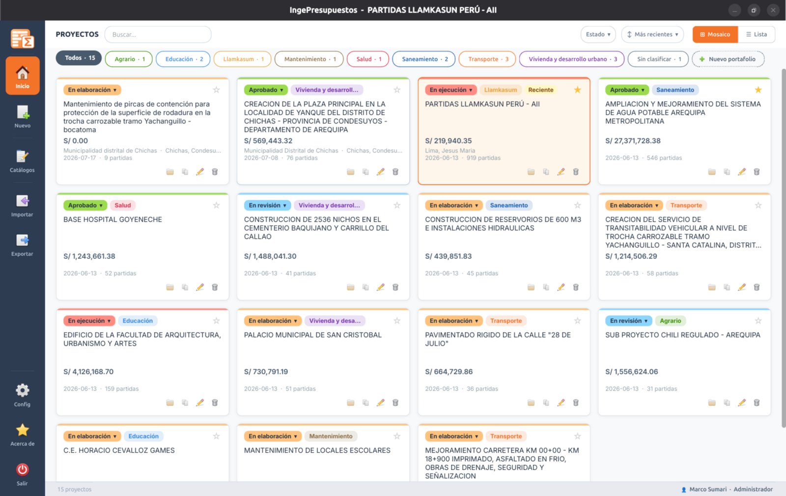

<!--
SPDX-License-Identifier: LicenseRef-Proprietary
Copyright (C) 2026 Marco Sumari / Sumari SAC. Todos los derechos reservados.
-->

# IngePresupuestos

**Software de presupuestos de obra civil** — nativo, multiplataforma (Linux · Windows · macOS), pensado para ingenieros, arquitectos y contratistas peruanos.

**Autor:** Ing. Marco Sumari · **Sumari · Arquitectura + Ingeniería**
**Licencia:** propietaria — ver [LICENSE](LICENSE)
**Web:** https://ingepresupuestos.com · **Manual:** https://docs.ingepresupuestos.com

> **Repositorio privado.** Este código es propiedad de Sumari SAC y no es de
> distribución pública. Las versiones 2.8.8 y anteriores se publicaron bajo
> GPL-3.0-or-later y conservan esa licencia; este repositorio corresponde a la
> 2.9.0 en adelante y no está cubierto por ella.

---



## ¿Qué hace?

- **Presupuestos** con árbol jerárquico, sub-presupuestos, **ACU** (Análisis de Costos Unitarios) editable y precios por proyecto.
- **Cronograma** completo estilo MS Project: **Gantt** interactivo con ruta crítica (CPM), Valorizado, **Curva S** y Adquisiciones. Exporta a PDF/Excel/Word/ODT/ODS y **MS Project (MSPDI XML)**.
- **Control de Obra**: requerimientos, almacén/kárdex, cuaderno de obra, valorizaciones y curva S real (programado vs reprogramado vs real).
- **Hoja de Metrados** con soporte de **acero** (diámetros peruanos, NTP 341.031 / ASTM A615).
- **Fórmula polinómica** (D.S. 011-79-VC) e **índices INEI**.
- **13 reportes** consistentes en **PDF · Excel · ODS · Word · ODT**.
- **Importadores nativos**: S10 (`.S2K`), PowerCost (`.prs`), Delphin (`.sqlite`), Excel, IFC y `.db` nativo.
- **Asistente IA (Tuxia)** y **«Sugerir partidas»** con búsqueda semántica local (RAG).

## Instalación

Descárgalo desde **https://ingepresupuestos.com**:

- **Windows** — instalador `.exe`, versión portable, o desde la **Microsoft Store** / `winget install ingepresupuestos`.
- **Linux** — AppImage (Flatpak próximamente).
- **macOS** — próximamente.

## Ejecutar desde el código fuente

Requiere **Python 3.11+**.

```bash
git clone https://github.com/<usuario>/ingepresupuestos-pyside6.git
cd ingepresupuestos-pyside6
python3 -m venv venv
source venv/bin/activate          # Windows: venv\Scripts\activate
pip install -r requirements.txt
python3 main.py
```

> **Linux:** para exportar ODT/ODS se usa LibreOffice headless (`sudo apt install libreoffice`). Para importar `.prs` de PowerCost: `sudo apt install -y mdbtools`.

## Tecnología

| Capa | Tecnología |
|------|-----------|
| Interfaz | PySide6 6.11 (Qt 6) |
| Backend | Python 3 puro |
| Base de datos | SQLite 3 |
| Reportes | QTextDocument + QPdfWriter · python-docx · openpyxl · LibreOffice (ODT/ODS) |

## Modelo de licencia

| | Gratis, sin límite de tiempo | Requiere licencia |
|---|---|---|
| Proyectos, presupuestos, ACU, cronograma, metrados, fórmula polinómica | ✅ | |
| Vista de Control de Obra (registrar almacén, cuaderno, valorizaciones) | ✅ | |
| Reportes del Centro de Reportes en **PDF** | ✅ | |
| Importadores (S10, PowerCost, Delphin, Excel, IFC, `.db`) | ✅ | |
| Asistente IA con la clave del propio usuario | ✅ | |
| Exportar **Excel · ODS · Word · ODT · MS Project** | 30 días de prueba | ✅ |
| **Reportes de Control de Obra** (todos, incluido PDF) | 30 días de prueba | ✅ |

Compra y activación: https://ingepresupuestos.com/licencia

La emisión de claves se hace con `scripts/gen_license.py` (firma RSA-2048 con la
clave privada, que vive fuera del repositorio en `~/.ingepresupuestos-licencias/`).

## Reportar un problema

Bugs y sugerencias a ing.sumari@gmail.com o por WhatsApp al +51 998 839 090.

## Licencia

Software propietario. Ver [LICENSE](LICENSE) para el contrato de usuario final y
[THIRD-PARTY-NOTICES.txt](THIRD-PARTY-NOTICES.txt) para los componentes de terceros.

© 2026 Marco Sumari · Sumari SAC. Todos los derechos reservados.
